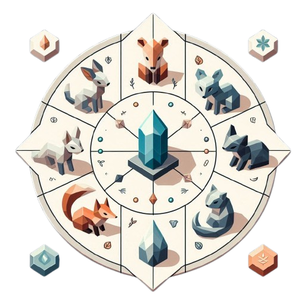

# <center> **Les Échos de Xérath**

<p align="center">
  
</p>

## Sommaire

- [I - Histoire](#i---histoire)
    - [Synopis](#synopsis-)
    - [Morale](#morale-)
- [II - Fonctionnement](#ii-fonctionnement)
- [III - Outils](#iii-outils)
- [IV - Origine](#iii---origine)
- [V - Crédits](#v---crédits)

## I - Histoire

### Synopsis :

Vous vous réveillez dans une maison étrange au cœur d’un village où les habitants sont… des animaux.    
Vous avez perdu la mémoire et ignorez pourquoi vous vous trouvez ici.    
Tout ce que vous avez, c’est un journal qui mentionne une malédiction de Xérath, et la promesse qu’en la brisant, vous sauverez les habitants.   

Au fil de vos explorations, vous découvrez des indices mystérieux et des fragments d’un cristal qui pourrait détenir la clé de votre survie.    
Mais alors que vous progressez, un événement choquant se produit : en réunissant les fragments, vous êtes transformé en animal.    
La vérité vous échappe, et les villageois, qui vous semblaient si étranges, connaissent des secrets que vous ne pouvez pas ignorer.   

Vous pensiez être là pour sauver les autres… mais et si c’était vous qui étiez l’étrange créature ?    
Que devez-vous vraiment sauver, et de qui ? Chaque fragment que vous collectez vous rapproche d’une révélation effrayante…    
Mais peut-être qu’il est déjà trop tard pour revenir en arrière.


**Morale :**
Vous choisissez d’accepter votre nouvelle forme et de vivre parmi les villageois, réalisant que la valeur et la "normalité" d’un être ne dépendent pas de son apparence, mais de sa capacité à nouer des relations sincères et à trouver le bonheur.

Ainsi, vous apprenez que la perfection que vous recherchiez n’était qu’une illusion et que l’acceptation de soi est la véritable clé de la paix intérieure.

## II - Fonctionnement

<ins>Pour cloner le répository :</ins>

```bash
git clone https://github.com/Luna30cf/Python-Game.git
```


<ins>Pour vérifier si vous avez python:</ins>
```bash
python -V
```


⚠️ <ins>Si vous n'avez pas python :</ins>   

https://www.python.org/downloads/


<ins>Pour installer Pygame :</ins>

```bash
pip install pygame

pip install pytmx
```


<ins>Pour lancer le projet :</ins>

```bash
Python-Game> python main.py
```

## III - Outils

### Tiled

*Tiled (signifiant tuilé en anglais) ou Tiled Map Editor est un logiciel libre de création de niveau de jeu vidéo par tuiles (d'où son nom) bitmap*   
*Il gère les tuiles rectangulaires, hexagonales et en perspective isométrique, et permet d'ajouter des zones de collision qui ne seront pas affichées à l'écran. Il permet également de gérer plusieurs calques de tuiles et de placer les tuiles au pixel près, plutôt que de la dimension d'une tuile, et également de gérer les transitions de terrain automatiques et les changements automatiques en fonction de motifs*


### Pygame
*Pygame est une bibliothèque libre multiplate-forme qui facilite le développement de jeux vidéo temps réel avec le langage de programmation Python.*   
*Construite sur la bibliothèque [SDL](https://fr.wikipedia.org/wiki/Simple_DirectMedia_Layer), elle permet de programmer la partie multimédia (graphismes, son et entrées au clavier, à la souris ou au joystick), sans se heurter aux difficultés des langages de bas niveaux comme le C et ses dérivés. Cela se fonde sur la supposition que la partie multimédia, souvent la plus contraignante à programmer dans un tel jeu, est suffisamment indépendante de la logique même du jeu pour qu'on puisse utiliser un langage de haut niveau (en l'occurrence le Python) pour la structure du jeu.*


## III - Origine

Ce projet est de base un projet de groupe donné par [Ynov Bordeaux Campus](https://www.ynov.com/campus/bordeaux) dans le cadre d'un projet python de 2e année.
Le repository de base :  [Python-Game](https://github.com/Luna30cf/Python-Game)   
J'ai vraiment beaucoup aimé développer ce jeu en groupe ainsi j'ai décidé de continuer à l'améliorer malgré la date de rendu passée.   
En espérant qu'il vous plaira !! 😁


## IV - Crédits

Merci à mes camarades qui ont réalisé ce projet scolaire avec moi

| Noms                         |                Adresses Mails |
| :-----------------------     |      -----------------------: |
|**Erika LAJUS**               |                      erika.ljs|
|**Karl DAVAL-LECLERCQ**       |                     NeptuneOff|


